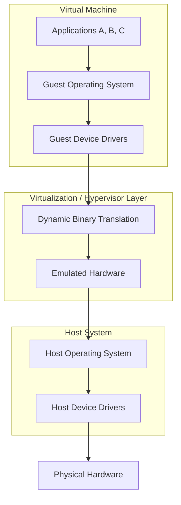

Full Virtualization represents the foundational generation of server virtualization for x86 and x64 architectures. This approach is characterized by its ability to provide a complete simulation of the underlying hardware, allowing a guest operating system to run entirely unmodified. The core mechanism enabling this is Dynamic Binary Translation. In this process, the virtualization layer intercepts privileged instructions from the guest OS and translates them into instructions that can safely execute on the host system.

A defining feature of this technology is transparency; the guest operating system remains unaware that it is functioning within a virtualized environment. It operates as if it has direct access to the physical CPU and peripherals, when in reality, every hardware component—including the processor itself—is being emulated. This abstraction is managed by an emulation layer that sits between the guest and the host operating system. This specific architecture, as illustrated in the provided diagram, typically involves a "Hosted" approach where the hypervisor relies on a Host OS to interact with the physical hardware.

Among the most prominent open-source implementations of this technology are QEMU and Bochs. These tools demonstrate the flexibility of full virtualization by allowing various operating systems to run on disparate hardware, though the overhead of constant binary translation and hardware emulation often results in lower performance compared to later virtualization methods.

The following diagram illustrates the structural hierarchy and the path of execution within a Full Virtualization stack:

